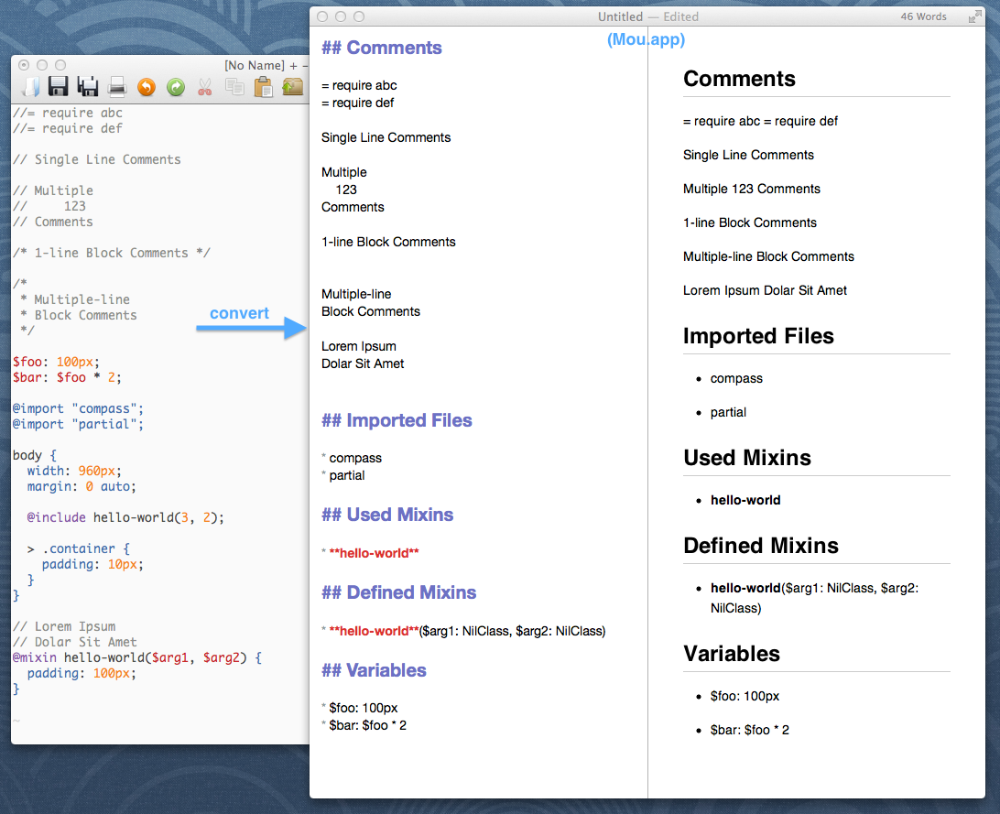

# Sassdoc

Sass Document Generator (Proof-of-Concept)

## Objects

* Auto-generate document from Sass / SCSS source code.
* Easy-to-write (Markdown?)
* Provide relationships among file references, e.g.:
  * what partial files does it depends on (inc. external library such as Compass)
  * what mixins / functions does it depends on
  * what variables / mixins / functions does it define or declare.
* Easy to navigate among references (mixin / partials / libraries) in the generated HTML document.

## Proof-of-Concept

Run the code:

    ruby sassdoc.rb

See printed markdown code, or paste it into Mou and profit:

## Implementation

It uses Sass's built-in parser, so there is no need to implement a parser from scratch.

## License

The MIT License

Copyright (c) 2013 Yu-Cheng Chuang

Permission is hereby granted, free of charge, to any person obtaining a copy of this software and associated documentation files (the "Software"), to deal in the Software without restriction, including without limitation the rights to use, copy, modify, merge, publish, distribute, sublicense, and/or sell copies of the Software, and to permit persons to whom the Software is furnished to do so, subject to the following conditions:

The above copyright notice and this permission notice shall be included in all copies or substantial portions of the Software.

THE SOFTWARE IS PROVIDED "AS IS", WITHOUT WARRANTY OF ANY KIND, EXPRESS OR IMPLIED, INCLUDING BUT NOT LIMITED TO THE WARRANTIES OF MERCHANTABILITY, FITNESS FOR A PARTICULAR PURPOSE AND NONINFRINGEMENT. IN NO EVENT SHALL THE AUTHORS OR COPYRIGHT HOLDERS BE LIABLE FOR ANY CLAIM, DAMAGES OR OTHER LIABILITY, WHETHER IN AN ACTION OF CONTRACT, TORT OR OTHERWISE, ARISING FROM, OUT OF OR IN CONNECTION WITH THE SOFTWARE OR THE USE OR OTHER DEALINGS IN THE SOFTWARE.